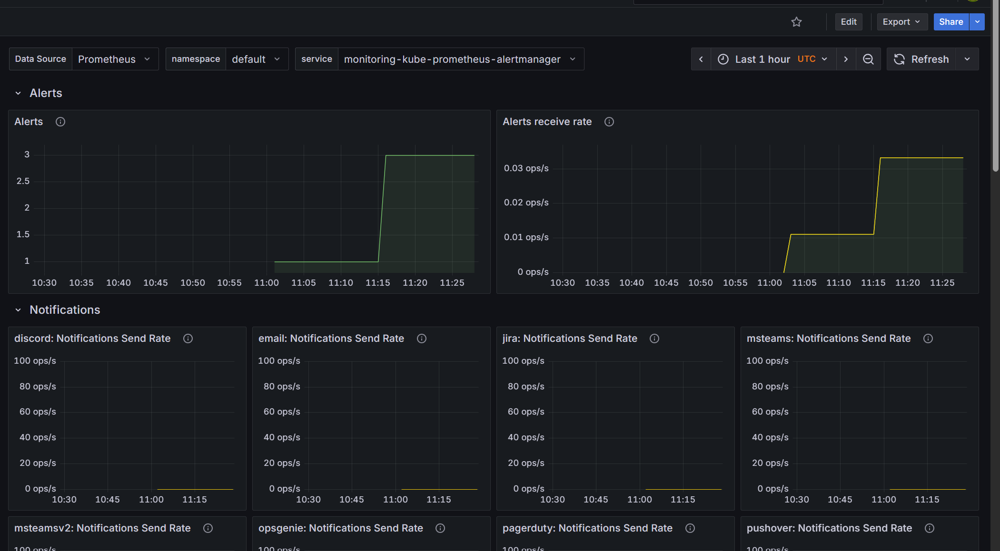

# DevOps Monitoring Project (Terraform + AWS EKS + Prometheus + Grafana)

This project sets up a full monitoring stack using **Terraform**, **AWS EKS**, **Prometheus**, **Grafana**, and **Alertmanager**.

## Features
- AWS EKS cluster with Terraform
- Kubernetes monitoring stack (Prometheus + Grafana)
- Custom alerts and dashboards
- Notifications with Alertmanager
- CI/CD ready for integration

## Setup Instructions

### 1. Clone the repository
```bash
git clone https://github.com/your-username/nodejs-eks-terraform-monitoring.git
cd nodejs-eks-terraform-monitoring
```

### 2. Provision Infrastructure (EKS Cluster)
```bash
cd terraform
terraform init
terraform apply
```

### 3. Configure kubectl
```bash
aws eks update-kubeconfig --region us-east-1 --name devops-monitoring-cluster
```

### 4. Deploy Monitoring Stack
```bash
helm repo add prometheus-community https://prometheus-community.github.io/helm-charts
helm repo update
helm upgrade --install monitoring prometheus-community/kube-prometheus-stack -f k8s/monitoring/prometheus-values.yaml
```

### 5. Verify Deployment
```bash
kubectl --namespace monitoring get pods
```

### 6. Grafana Access
**Username:** admin  
**Password:**
```bash
kubectl get secret monitoring-grafana -n monitoring -o jsonpath="{.data.admin-password}" | base64 -d
```

**URL:**
```bash
kubectl get svc monitoring-grafana -n monitoring
```

Use the LoadBalancer URL to access Grafana in your browser.

---

## Architecture
